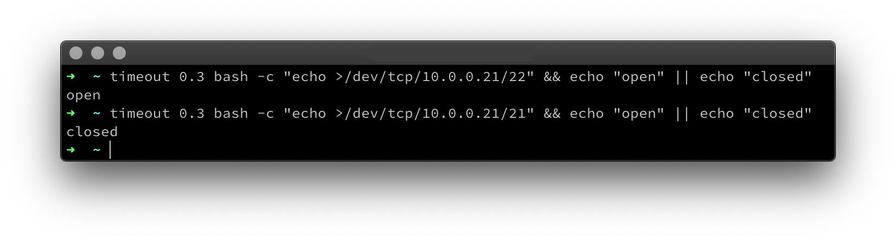
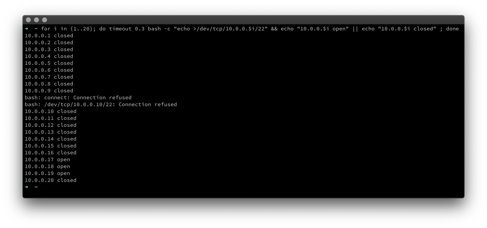

Hacker aufgepasst, ich zeige euch heute wie ihr auf einem Linux System, ohne zusätzliche Software installieren zu müssen, das Netzwerk nach offenen Ports scannen könnt.

Es gibt unter Linux sogenannte „pseudo-devices“, diese liegen meist unter /dev. Dahinter verbirgt sich kein Gerätetreiber, sondern nur eine Systemschnittstelle.

Wir machen uns das pseudo-device /dev/tcp zunutze, um im Netzwerk nach offenen Ports zu suchen. Dieses lässt sich mit folgender Syntax verwenden:

```bash
/dev/tcp/[host]/[port]
```

Mit diesem Befehl wird zum Beispiel Port 22 auf dem Host 10.0.0.21 überprüft.
```bash
timeout 0.3 bash -c "echo >/dev/tcp/10.0.0.21/22" && echo "open" || echo "closed"
```

{: class="post"}

Wenn der Port antwortet, wird „open“ angezeigt, so wie im oben gezeigten Befehl. Kommt vom Port keine Antwort, ist dieser geschlossen und die Abfrage wird durch den timeout Befehl nach 3 Sekunden abgebrochen.

Das Ganze funktioniert nur mit dem TCP Protokoll, da UDP „stateless“ ist, dass bedeutet es kommt keine Antwort als Bestätigung zurück.

Hier noch ein Beispiel, wie mehrere IP-Adressen gescannt werden können:
{: class="post"}

Viel Spaß beim Ausprobieren.

### References:
- [https://catonmat.net/tcp-port-scanner-in-bash](https://catonmat.net/tcp-port-scanner-in-bash)
- [https://www.gnu.org/software/bash/manual/html_node/Redirections.html](https://www.gnu.org/software/bash/manual/html_node/Redirections.html)
